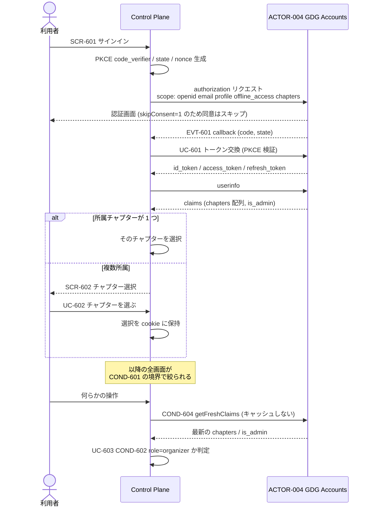
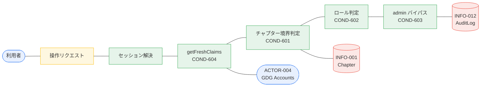

# BIZ-006 認証・認可

GDG Accounts (`https://accounts.gdgs.jp`) を IdP とし、チャプター所属とロールを
そのままテナント境界と権限に使う。アプリ独自のユーザー管理は持たない。

## IdP の仕様（調査済みの事実）

| 項目 | 値 | 出典 |
|---|---|---|
| issuer | `https://accounts.gdgs.jp`（discovery 必須、個別 URL はハードコードしない） | `accounts-oidc-client-demo/src/index.ts:163-172` |
| フロー | Authorization Code + PKCE S256 の confidential client (`client_secret_basic`) | `accounts/CLAUDE.md:18-20` |
| スコープ | `openid email profile offline_access https://gdgs.jp/scopes/chapters` | `gdg-lib/src/auth/rp.ts:187` |
| チャプタークレーム | `https://gdgs.jp/claims/chapters` = `{chapterId:number, chapterSlug:string, role:"organizer"\|"member"}[]` | `accounts/app/lib/auth.server.ts:188-202` |
| 横断管理者 | `https://gdgs.jp/claims/is_admin` = boolean | 同上 |
| トークン寿命 | access 1 時間 / refresh 30 日 | `accounts/app/lib/auth.server.ts:174-175` |

## 実装上の必須事項

- **`chapters` 配列を使う。** `gdg-lib` の単数 `chapter` は「プライマリ（organizer 優先 → 最古承認順）」の
  レガシー互換フィールドであり、新規実装は配列を使うよう明記されている
  （`gdg-lib/src/auth/index.ts:24-28`）。**1 ユーザー = 1 チャプターで設計してはならない。**
- **クレームは防御的にパースする。** `chapterId` が number でないエントリを破棄する既存実装を踏襲する
  （`gdg-lib/src/auth/rp.ts:648-675`）。
- **認可判定でクレームをキャッシュしない（COND-604）。** 既存 `stream` アプリのコメントが
  「アクセスを決定する画面にこのキャッシュをコピーするな」と明示的に警告している。`getFreshClaims()` を使う。
- **複数チャプター UX は `sns` を参考にする。** cookie で「現在選択中のチャプター」を切り替える方式
  （`sns/app/lib/access.server.ts:26-59`）。
- **権限プリミティブは `accounts/app/lib/permissions.ts:1-36`**（`canManageChapter` / `requireOrganizerOf`）を再利用する。
- **チャプター名の表示**は公開ディレクトリ API `accounts/app/routes/api.chapters.directory.ts`
  （`{id, slug, name, kind}`）から取得する。メンバーシップは非公開。

## OAuth クライアントの登録形態

**第一者クライアントとしてシードする。** セルフサービス登録（`/developers/apps`）ではなく、
`accounts/app/lib/seed-clients.server.ts` の `collectSpecs()` にエントリを追加し、
`/admin/seed-clients` で投入する。

**理由**: セルフサービス登録したクライアントは、**オーナーが全チャプター所属を失うと
D1 トリガで自動的に無効化され、発行済みトークンも削除される**
（`accounts/schema.sql:148-170`、`UPDATE oauthClient ... WHERE userId = OLD.user_id`）。
常時稼働する共有インフラでこれは許容できない。

一方 `seedClients()` の INSERT は **`userId` 列を含まない**ため、シードされたクライアントの
`userId` は NULL であり、トリガの `WHERE userId = OLD.user_id` に決して一致しない。
**第一者クライアントは構造的にこのリスクを免れる。**

必要な変更は小さい:

| 対象 | 変更 |
|---|---|
| `accounts/app/lib/seed-clients.server.ts` | `collectSpecs()` の `apps` 配列に 1 エントリ追加 |
| `accounts` の環境変数 | `DISCORD_RELAY_CLIENT_ID` / `_CLIENT_SECRET` / `_REDIRECT_URLS` |
| 投入 | `/admin/seed-clients` を開く |

**注意**: `ON CONFLICT DO UPDATE` は `userId` をクリアしない。既にセルフサービス登録した
clientId を再利用せず、新規の clientId を採番すること。

## 業務フロー: BUC-601 / BUC-602 ログインとチャプター選択

## ロバストネス図: UC-603 認可判定する

## Plane 間認証 (BUC-603 / UC-605)

Data Plane は OCI 上の常時稼働プロセスで、Control Plane (Cloudflare Workers) と
双方向にやりとりする。

| 方向 | 内容 | 認証 |
|---|---|---|
| CP → DP | 設定（ルール・紐付け・Intent）の伝播 | サービス間認証 |
| DP → CP | 接続状態・配信履歴・メトリクスの提供 | サービス間認証 |

**OCI 側のエンドポイントはインターネットに直接露出しない**（REQ-602）。
Cloudflare Tunnel 経由で公開し、Cloudflare Access のサービストークンまたは
共有シークレット / mTLS で認証する。具体方式は技術スタック検討時に決定する。

## 設計上の注意

- **ロールは organizer / member の 2 値しかない。** 細かい権限が必要になったら
  アプリ側に独自ロールを持つことになるが、本アプリではその必要がないと判断した（D-4）。
- **クレームはトークン発行のたびに D1 から読み直される**（`accounts/CLAUDE.md:30`）。
  キャッシュされた古い所属は返らないので、IdP を信頼してよい。
- **`is_admin` は同じ chapters スコープで付いてくる**。別スコープの取得は不要。
