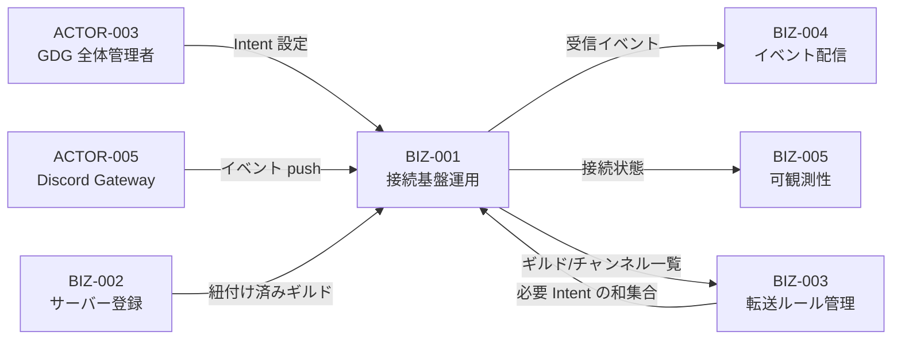
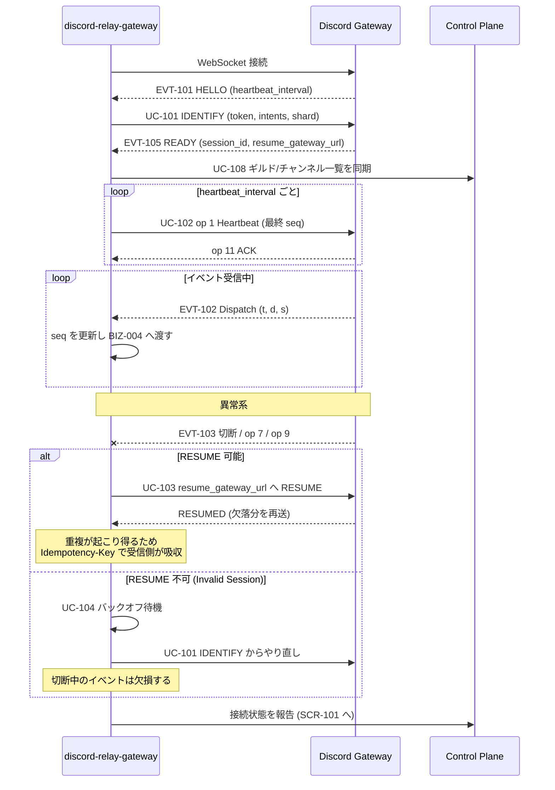
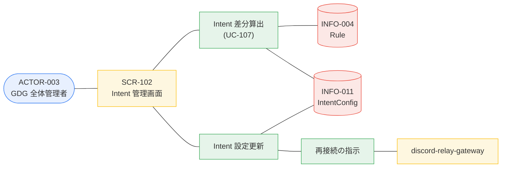

# BIZ-001 接続基盤運用

`discord-relay-gateway`（OCI）が専用 Bot トークンで Discord Gateway に単一セッションを張り、
紐付け済みギルドのイベントを受信し続ける。全チャプターがこの 1 本の接続に依存する。

## ビジネスコンテキスト図

## 業務フロー: BUC-101 Gateway 接続を維持する

## ロバストネス図: UC-106 Intent 設定を変更する

## 設計上の注意

- **単一障害点**: この 1 接続が全チャプターの生命線。切断継続は BIZ-005 のアラート対象（VAR-501）。
- **欠損は避けられない**: RESUME の範囲を超えた切断中のイベントは失われる。これは非目標であり、
  「接続している限り at-least-once」が本アプリの保証水準（GOAL-001 の但し書き）。
- **重複は起こる**: RESUME はイベントを再送する。受信側が吸収できるよう BIZ-004 が `Idempotency-Key` を付ける。
- **Intent は最小に保つ**: `TYPING_START` / `PRESENCE_UPDATE` は量が多く、購読するルールが無ければ
  そもそも Intent を有効にしない。これが最も効く負荷削減。
- **シャーディングは当面不要**: 単一シャードは 2500 ギルドまで対応する。ただし
  100 サーバー到達で Bot verification が必要（overview.md の SETUP-4）。
