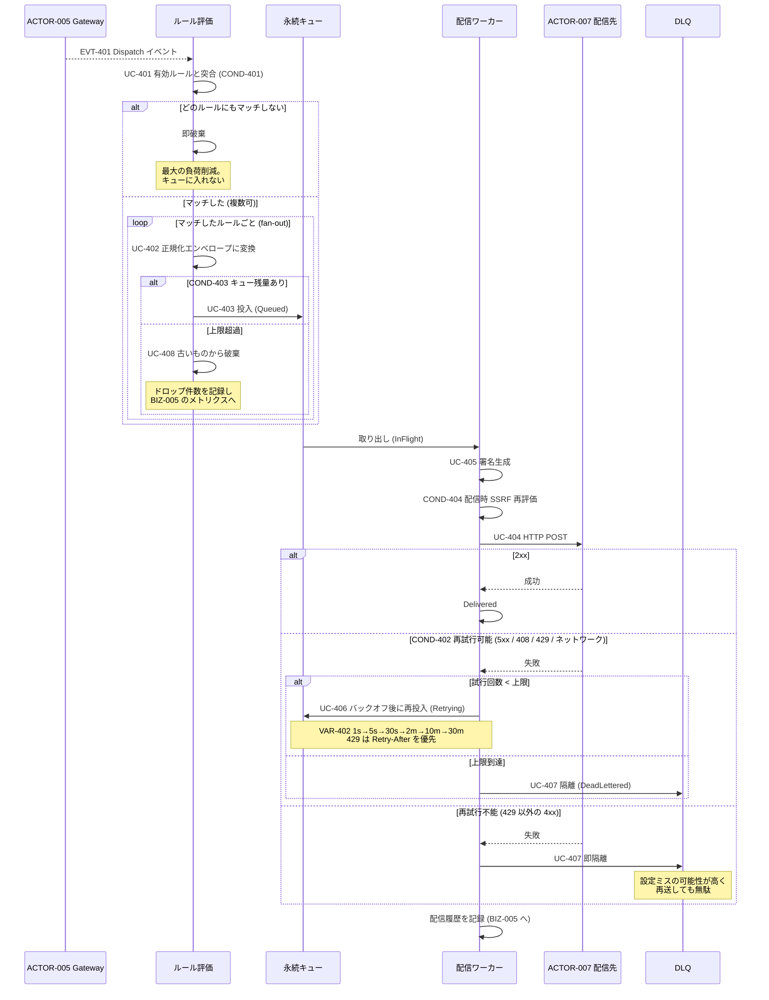
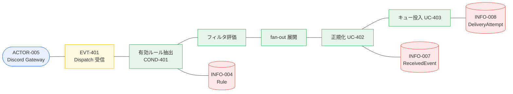

# BIZ-004 イベント配信

Gateway から受けたイベントをルールで評価し、正規化して配信先へ届ける。
本アプリで唯一、人が介在しない完全自動のコンテキスト。

## 正規化エンベロープ (UC-402)

```json
{
  "id": "01JBX8Z9K2M4N6P8Q0R2S4T6V8",
  "type": "discord.MESSAGE_CREATE",
  "occurred_at": "2026-09-03T12:34:56.789Z",
  "chapter": { "id": 12, "slug": "tokyo" },
  "guild":   { "id": "123456789012345678", "name": "GDG Tokyo" },
  "channel": { "id": "234567890123456789", "name": "general", "type": 0, "parent_id": null },
  "actor":   { "id": "345678901234567890", "username": "someone", "global_name": "Someone", "bot": false },
  "rule":    { "id": "rule_01JBX...", "name": "新規投稿を n8n へ" },
  "raw":     { "...Discord の d フィールドをそのまま..." }
}
```

共通メタで包みつつ `raw` に生データを同梱するため、受信側は用途に応じてどちらも使える。

## HTTP ヘッダ (UC-405)

| ヘッダ | 値 |
|---|---|
| `Content-Type` | `application/json` |
| `X-Discord-Relay-Event` | `MESSAGE_CREATE` |
| `X-Discord-Relay-Delivery-Id` | 配信試行ごとに一意な ID |
| `X-Discord-Relay-Timestamp` | Unix 秒 |
| `X-Discord-Relay-Signature` | `v1=<hex HMAC-SHA256(timestamp + "." + body)>` |
| `Idempotency-Key` | イベント一意キー (エンベロープの `id`) |
| `User-Agent` | `discord-relay/1.0` |

**timestamp を署名対象に含める**ことでリプレイ攻撃を防ぐ（Stripe と同じ方式）。
受信側は timestamp の鮮度を検査したうえで署名を検証する。

**`Idempotency-Key` は必須の設計要素**である。BIZ-001 の RESUME はイベントを再送するため、
同じイベントが 2 回配信され得る。受信側がこのキーで吸収できることを前提に、
本アプリは at-least-once に振り切る。

## 業務フロー: BUC-401 / BUC-402 受信から配信・再送・隔離まで



## ロバストネス図: UC-401 ルールを評価する



## 設計上の注意

- **評価は受信直後、キュー投入の前**（UC-401 → UC-403 の順序）。
  購読者のいないイベントをキューに入れないことが、最も効く負荷対策。
  さらに上流では BIZ-001 が「必要な Intent しか有効にしない」ことで受信自体を絞る。
- **順序は保証しない**（非目標）。並列配信するため、同一チャンネルの 2 件が入れ替わり得る。
  必要になったらチャンネル単位の順序保証モードを後付けする設計余地を残す。
- **配信時にも SSRF ガードを回す（COND-404）**。登録時のみの検証は DNS 再バインドで破られる。
- **4xx を再試行しない理由**: 設定ミス（URL 誤り、認証ヘッダ不足）が原因である可能性が高く、
  再送しても成功しない。早く DLQ に出して organizer に気づかせるほうが価値がある。
- **ドロップは黙って行わない**。件数を必ず記録し、BIZ-005 のメトリクスとアラートに出す。
