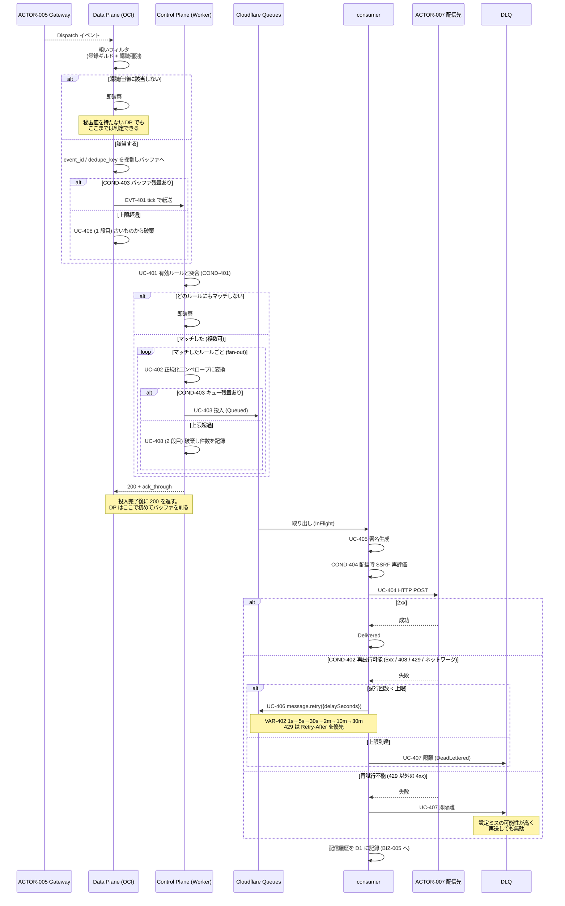
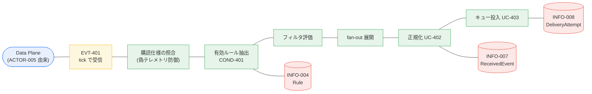

# BIZ-004 イベント配信

Data Plane が転送したイベントを Control Plane がルールで評価し、正規化して配信先へ届ける。
本アプリで唯一、人が介在しない完全自動のコンテキスト。

## Plane 担当

[ADR-001](../../../discord-relay/adr.md#adr-001-data-plane-を-gateway-転送専用に絞り配信を-control-plane-に寄せる)
により、**このコンテキストのほぼ全体が Control Plane で動く**。

| 担当 | 内容 |
|---|---|
| Data Plane (OCI) | 粗いフィルタ（登録ギルド + 購読イベント種別）、転送バッファ、tick での転送、UC-408 の 1 段目 |
| Control Plane (Workers) | UC-401 〜 UC-407 のすべて、UC-408 の 2 段目 |

Data Plane は配信先 URL・署名シークレット・カスタムヘッダ・細かいフィルタを一切持たない。

## 正規化エンベロープ (UC-402)

```json
{
  "id": "01JBX8Z9K2M4N6P8Q0R2S4T6V8",
  "type": "discord.MESSAGE_CREATE",
  "occurred_at": "2026-09-03T12:34:56.789Z",
  "chapter": { "id": 12, "slug": "tokyo" },
  "guild":   { "id": "123456789012345678", "name": "GDG Tokyo" },
  "channel": { "id": "234567890123456789", "name": "general", "type": 0, "parent_id": null },
  "actor":   { "id": "345678901234567890", "username": "someone", "global_name": "Someone", "bot": false },
  "rule":    { "id": "rule_01JBX...", "name": "新規投稿を n8n へ" },
  "raw":     { "...Discord の d フィールドをそのまま..." }
}
```

共通メタで包みつつ `raw` に生データを同梱するため、受信側は用途に応じてどちらも使える。

`chapter` が入るのは Control Plane で正規化するからである。Data Plane はチャプターを知らない。

## HTTP ヘッダ (UC-405)

| ヘッダ | 値 |
|---|---|
| `Content-Type` | `application/json` |
| `X-Discord-Relay-Event` | `MESSAGE_CREATE` |
| `X-Discord-Relay-Delivery-Id` | 配信試行ごとに一意な ID（リトライで変わる） |
| `X-Discord-Relay-Timestamp` | Unix 秒 |
| `X-Discord-Relay-Signature` | `v1=<hex HMAC-SHA256(timestamp + "." + body)>` |
| `Idempotency-Key` | エンベロープの `id`（リトライでも RESUME 再配送でも変わらない） |
| `User-Agent` | `discord-relay/1.0` |

**timestamp を署名対象に含める**ことでリプレイ攻撃を防ぐ（Stripe と同じ方式）。
受信側は timestamp の鮮度を検査したうえで署名を検証する。

## エンベロープ `id` は決定的でなければならない

**`Idempotency-Key` が必要な理由は RESUME にある。** BIZ-001 の RESUME は切断中のイベントを
再送するため、同じ Discord イベントが 2 回パイプラインに入り得る。受信側がこのキーで
吸収できることを前提に、本アプリは at-least-once に振り切る。

したがって **`id` をランダムに採番してはならない**。同じイベント × 同じルールなら、
何度パイプラインを通っても同じ値でなければキーの意味がない
（[ADR-004](../../../discord-relay/adr.md#adr-004-tick-エンドポイント-1-本に-heartbeatコマンドconfig-バージョンを相乗りさせる)）。

| 識別子 | 生成 | 用途 |
|---|---|---|
| `event_id` | Data Plane が受信時に ULID を採番 | 転送リトライの冪等キー、順序、tick の `ack_through` |
| `dedupe_key` | `sha256(event_type ‖ canonical_json(d))` | RESUME 再配送の同一性判定 |
| エンベロープ `id` | `sha256(dedupe_key ‖ rule_id)` を ULID 形式に整形 | `Idempotency-Key` |

`canonical_json` はキーを再帰的にソートし空白を除いたもの。Discord が再配送時にフィールドを
変えないことに依存する best-effort であり、**完全な重複排除を保証するものではない**。
`Idempotency-Key` は受信側の冪等性を助けるためのもので、本アプリが exactly-once を
主張するものではない。

## 業務フロー: BUC-401 / BUC-402 受信から配信・再送・隔離まで



## ロバストネス図: UC-401 ルールを評価する



## 設計上の注意

- **絞り込みは 2 段になった。** 1 段目は Data Plane の粗いフィルタ（ギルド + イベント種別）で、
  ネットワークを渡る量を決める。2 段目は Control Plane のルール評価で、キューに入る量を決める。
  RDRA が当初から挙げていた「購読者のいないイベントをキューに入れない」という負荷対策は、
  2 段目としてそのまま生きている。さらに上流では BIZ-001 が
  「必要な Intent しか有効にしない」ことで受信自体を絞る。
- **tick に 200 を返す前にキュー投入を完了させる。** これを守らないと、
  Data Plane が「送った」と判断してバッファを削った直後にイベントが消える。
- **順序は保証しない**（非目標）。並列配信するため、同一チャンネルの 2 件が入れ替わり得る。
  Queues も宛先キーごとの順序を持たない。必要になったらチャンネル単位の
  順序保証モードを後付けする設計余地を残す。
- **宛先ごとのレート制限は best-effort**（UC-404）。Queues に同時実行の宛先別制御が無いため、
  当面は 429 の `Retry-After` 尊重で凌ぐ。必要になったら宛先ごとの Durable Object を挟む。
- **配信時にも SSRF ガードを回す（COND-404）。** 配信が Control Plane に移り危険度は下がったが、
  Cloudflare がプライベート宛先への到達不能をセキュリティ保証として文書化しているわけではない。
- **4xx を再試行しない理由**: 設定ミス（URL 誤り、認証ヘッダ不足）が原因である可能性が高く、
  再送しても成功しない。早く DLQ に出して organizer に気づかせるほうが価値がある。
- **ドロップは黙って行わない**。2 段のどちらで捨てたかを区別して記録し、
  BIZ-005 のメトリクスとアラートに出す。Data Plane 側の件数は tick の `dropped_total` で報告する。
- **Control Plane が落ちると配信が止まる。** Data Plane は受信とバッファリングを続けるので、
  バッファ上限に達するまでは復旧後に流れる。「CP 障害が何分続いたら失い始めるか」は
  バッファ上限とイベント流量で決まる設計パラメータであり、監視対象になる。
