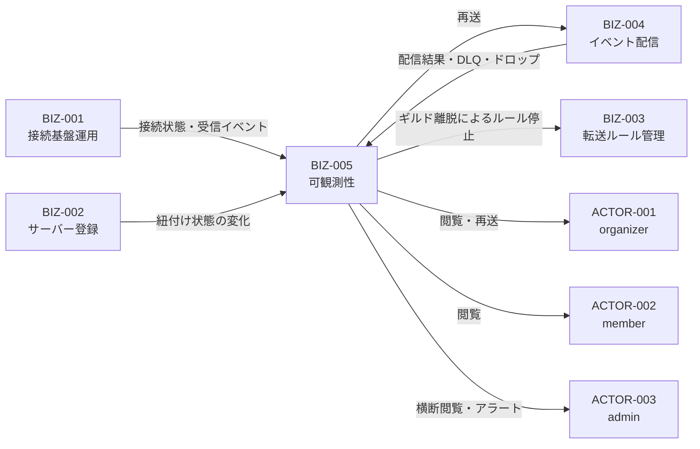
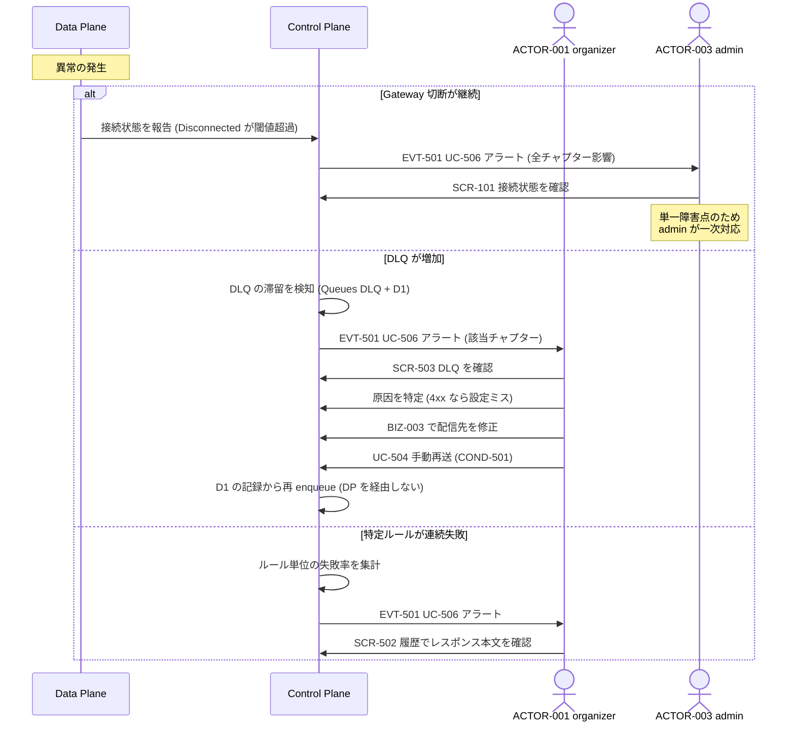
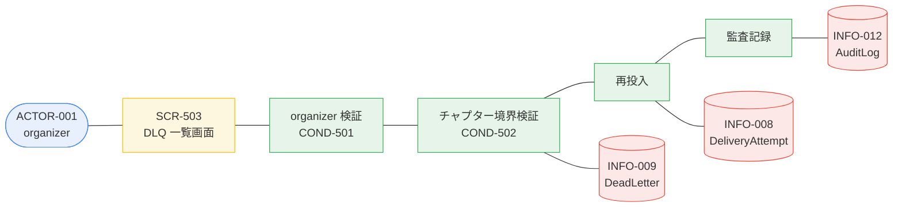

# BIZ-005 可観測性・障害対応

配信は人の目に触れない場所で起きるため、「動いているか」「なぜ動かないか」が
見えることそのものが機能になる。

## 中核はライブイベントビューア (UC-501)

設定のデバッグで最も困るのは「ルールを作ったのにイベントが来ない」状況で、原因が
Intent 未有効・フィルタの絞りすぎ・ギルド未紐付け・Bot 権限不足のどれかを切り分けられない点にある。

ライブビューアは受信イベントを tail しながら、各イベントについて
**どのルールにマッチしたか / しなかった場合はどの条件で落ちたか**を併記する。
これにより上記の切り分けが画面内で完結する。

## ビジネスコンテキスト図

## 業務フロー: BUC-502 障害を検知して対処する

## ロバストネス図: UC-504 手動で再送する

## プライバシー上の扱い

配信履歴には**メンバーのメッセージ本文が含まれ得る**。

- 既定では member も自チャプター分の履歴を閲覧できる。チャプターの Discord の内容は
  そのチャプターのメンバーが見られて自然である、という判断による。
- ただし**ルール単位で「ペイロードを保存しない」オプション**を用意する（COND-503）。
  この場合、メタ情報（イベント種別・時刻・結果）のみを記録し本文は残さない。
- 保持期間（VAR-502）を過ぎたペイロードは UC-508 で削除する。
- admin の横断閲覧は必ず監査ログに残す（BIZ-006 COND-603）。

## 設計上の注意

- **メトリクスはチャプター別とグローバルの両方**を持つ。organizer は自分の影響範囲を、
  admin は接続の健全性を見る。
- **Gateway 切断アラートの宛先は admin**。単一接続が全チャプターの単一障害点であり、
  個々の organizer には対処できない。
- **DLQ アラートの宛先は該当チャプターの organizer**。設定ミスが原因のことが多く、
  直せるのは organizer だけ。
