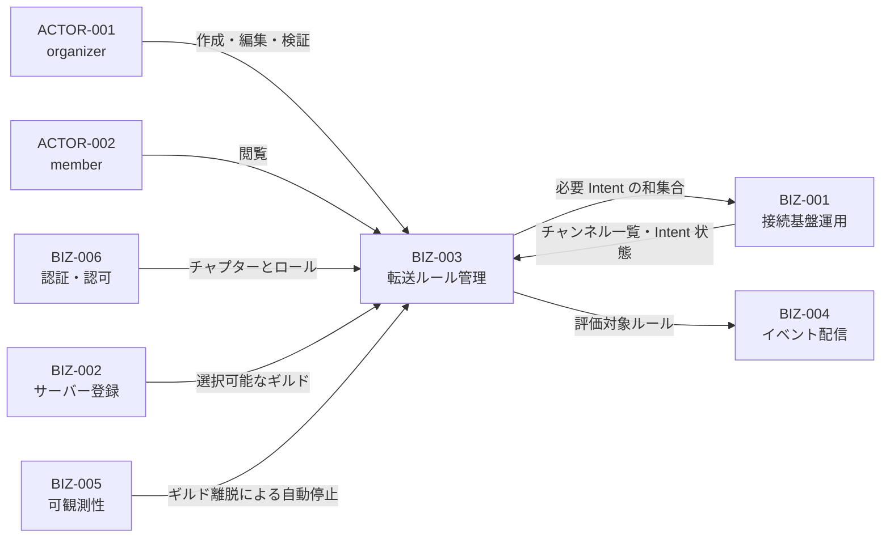
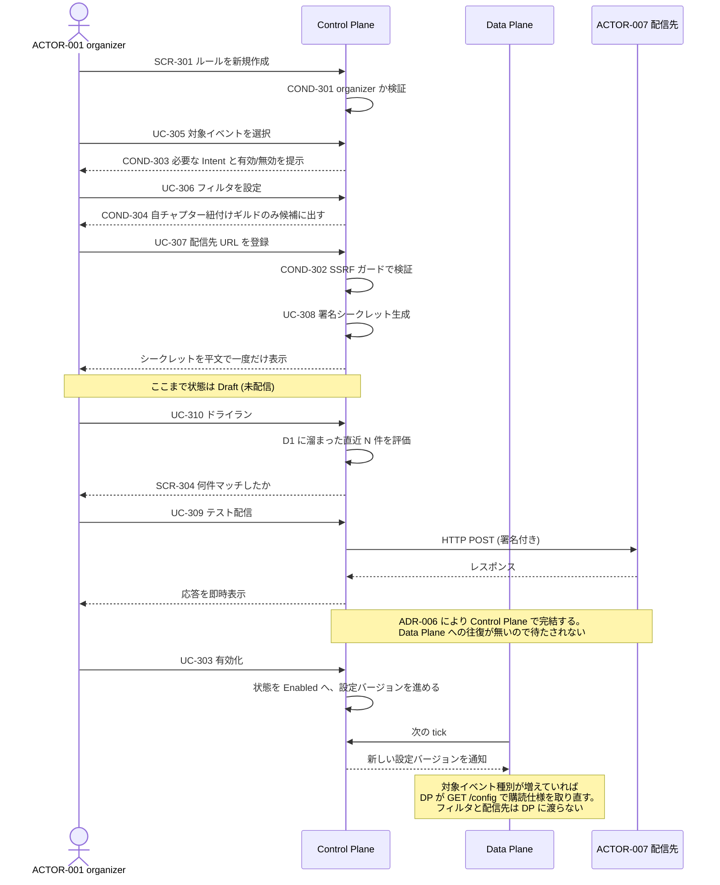
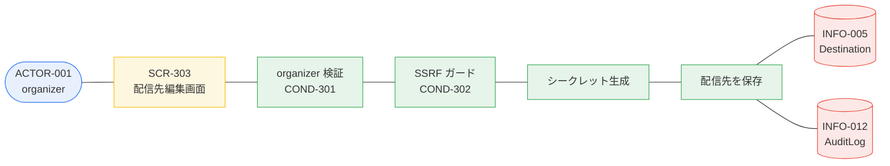

# BIZ-003 転送ルール管理

「どのイベントをどこへ流すか」を画面から管理する。本アプリの主要な価値提供面。

## ルールの構成

```
ルール (INFO-004)
  ├─ 名前 / 状態 (Draft | Enabled | Disabled | Suspended)
  ├─ 所属チャプター
  ├─ 対象イベント種別 (VAR-301, 複数選択)
  ├─ フィルタ (VAR-302)
  │    ├─ ギルド        … COND-304 自チャプター紐付け分のみ
  │    ├─ チャンネル     … スレッドを含むかを選択
  │    ├─ ユーザー
  │    ├─ Bot 発言の除外
  │    └─ ロール
  └─ 配信先 (INFO-005)
       ├─ URL           … COND-302 SSRF ガード
       ├─ カスタムヘッダ
       ├─ タイムアウト
       └─ 署名シークレット … VAR-303 マスキング
```

複数のルールが同じイベントにマッチした場合、**優先順位は設けず、それぞれ独立に配信する**（fan-out）。

## ビジネスコンテキスト図



## 業務フロー: BUC-301 / BUC-302 ルールを作って検証し、有効化する



## ロバストネス図: UC-307 配信先を登録する



## SSRF ガードの要件 (COND-302)

配信先 URL は外部から自由に指定できるため、内部ネットワークへの踏み台になり得る。

[ADR-001](../../../discord-relay/adr.md#adr-001-data-plane-を-gateway-転送専用に絞り配信を-control-plane-に寄せる)
により配信は Control Plane から出るようになった。Cloudflare のネットワークからは
インスタンスメタデータ `169.254.169.254` のようなリンクローカル宛が**そもそも経路上に存在しない**ため、
この要件は「実装が正しくないと危険」から **「多層防御の 1 枚目」** に位置づけが変わった。

**ただし要件自体は残す。** Cloudflare がプライベート宛先への到達不能を
セキュリティ保証として文書化しているわけではなく、将来 fat DP へ戻す判断が
あり得る以上、ガードを外す理由がない。

| チェック | 内容 |
|---|---|
| スキーム | `https` のみ許可（開発環境を除く） |
| 宛先 IP | プライベート (10/8, 172.16/12, 192.168/16)、ループバック (127/8, ::1)、リンクローカル (169.254/16, fe80::/10)、CGNAT (100.64/10) を拒否 |
| DNS 再バインド | 登録時の検証だけでなく、**配信時にも解決結果を再チェック**する |
| リダイレクト | 追跡回数を制限し、リダイレクト先も同じガードを通す |
| ポート | 極端なポートを制限（任意）|

## 設計上の注意

- **秘匿情報の扱い（VAR-303）**: 配信先 URL は「そこへ POST できる」能力そのものなので、
  実質的にシークレット。member にはホスト名とパス先頭のみを見せる。
  署名シークレットは生成直後の一度だけ平文表示し、以降は再表示不可・ローテーションのみ。
- **Intent 未有効でもルールは作れる（COND-303）**: 作成をブロックすると、
  「先にルールを用意して admin に Intent 有効化を依頼する」という自然な運用ができなくなる。
  作成は許し、警告と「まだ届かない」旨の明示で担保する。
- **フィルタは基本のみ**: 正規表現と式言語（CEL / JSONata）は非目標。
  必要になった場合の拡張余地だけ INFO-004 のスキーマに残す。
