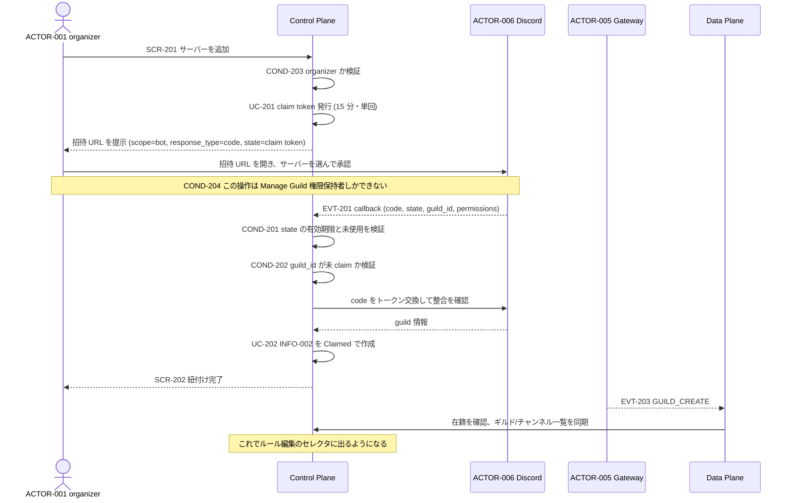
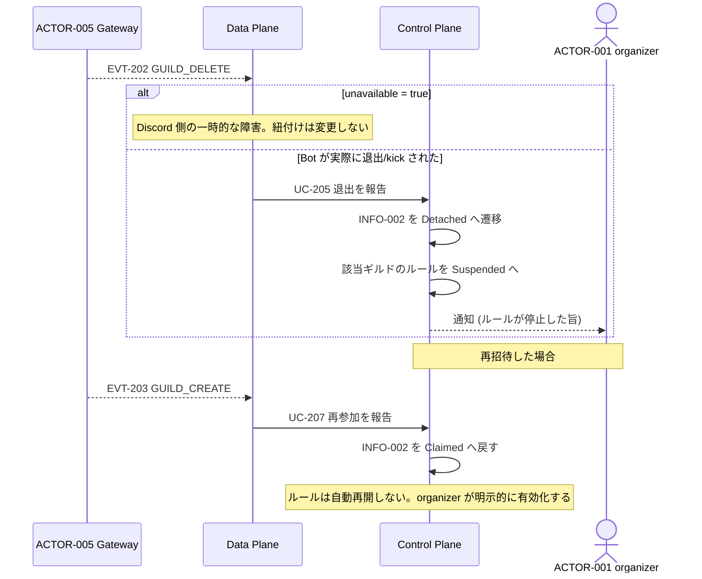
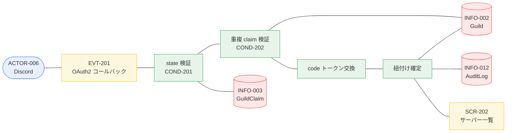

# BIZ-002 サーバー登録

「この Discord サーバーはこのチャプターのものである」を、詐称できない形で確定する。

## 検証の考え方

**Discord 側の権限判定をそのまま信頼する。** Bot を招待できるのは、そのサーバーで
「サーバーの管理」権限を持つ者だけである。したがって「招待に成功した」という事実自体が
「その人はそのサーバーの管理者である」ことの証明になる。アプリ側で Discord のロールを
読み直す必要はない（COND-204）。

`response_type=code` と `redirect_uri` を付けた招待 URL を使うことで、Discord は
コールバックに **`guild_id` と `state` を返す**。これにより `GUILD_CREATE` の到着を
待たずに紐付けを確定できる。

## 既存実装との関係

wiki が同じ形の招待フローを実装済みで、実装パターンをそのまま踏襲できる。

| wiki の実装 | 本アプリでの対応 |
|---|---|
| `wiki/app/routes/api/discord/auth.ts` | UC-201 招待リンク発行の参考 |
| `wiki/app/routes/api/discord/callback.ts` | UC-202 コールバック検証の参考 |
| `wiki/app/routes/api/discord/guilds.ts` | botInstalled フラグ付きサーバー一覧の参考 |
| `wiki/app/features/discord/oauth.server.ts` / `token.server.ts` | トークン交換の参考 |
| `wiki/app/routes/sources/_components/DiscordChannelDialog.tsx` | SCR-201 の UI 参考 |

**ただし `wiki.discord_guild_settings` テーブルは共有しない。** 目的が「リマインダー送信先チャンネル」で
あり、`chapter_id` の UNIQUE 制約により 1 チャプター 1 ギルドに固定されている。本アプリは
1 チャプターに複数ギルドを許すため、自前のテーブル（INFO-002）を持つ。

**Bot は専用 Application のもの**（overview.md D-9）なので、wiki の Bot が既に入っている
サーバーであっても、本アプリの Bot は改めて招待が必要になる。

## 業務フロー: BUC-201 Discord サーバーをチャプターに登録する

## 業務フロー: BUC-202 Bot 退出を検知して設定を停止する

## ロバストネス図: UC-202 招待コールバックを検証して紐付けを確定する

## 設計上の注意

- **`GUILD_DELETE` の `unavailable`**: Discord 側の一時障害では `unavailable: true` が来る。
  これを退出と誤認すると、障害のたびにルールが止まる。必ず区別する。
- **再参加でルールを自動再開しない**: 一度停止したルールを黙って再開すると、
  意図しない配信が復活し得る。organizer の明示操作を要求する。
- **claim token はチャプターに束縛する**: token 単体が漏れても、発行時のチャプター以外には
  紐付けられないようにする。
