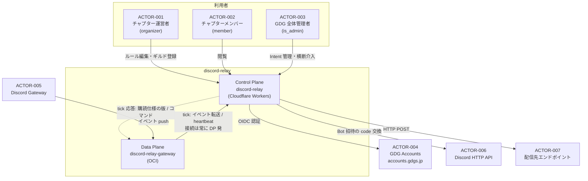
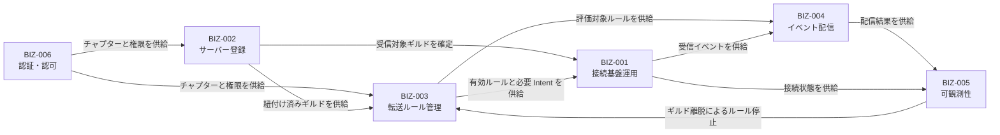

# discord-relay — 全体概観

Discord 上で発生したイベントを、外向き Webhook として任意の HTTP エンドポイントへ転送する。
Discord が提供する Webhook は **受信専用**（外部 → Discord）で、その逆は存在しない。本アプリはその欠落を埋める。

## リポジトリ内の既存資産との関係

本アプリは白紙から始まらない。upstream に以下が既に存在する。

| 既存 | 内容 | 本アプリでの扱い |
|---|---|---|
| 共通 Discord Application | `docs/discord-source-setup.md`。wiki のリマインダーと agents のクエリ Bot が同一 Application を共有する運用が確立している | **再利用しない（D-9）。** discord-relay 専用の Application と Bot トークンを新規に建てる。理由は下記「Gateway セッションの排他」 |
| `MESSAGE_CONTENT` Intent | 上記 §1-2 で wiki/agents の Application では既に有効化済み | 専用 Application では**改めて有効化が必要**（運用手順 SETUP-2） |
| Bot 招待 + ギルドピッカー | `wiki/app/routes/api/discord/{auth,callback,guilds,guild-channels}.ts`、`wiki/app/features/discord/`、`DiscordChannelDialog.tsx`。`botInstalled` フラグ付きのサーバー一覧と bitfield `66560` の招待 URL 生成 | **BIZ-002 の下敷きにする。** 実装パターンを踏襲する |
| `wiki.discord_guild_settings` | `guild_id` → `chapter_id` の 1:1 マッピング（`chapter_id` に UNIQUE） | **共有しない。** 目的が「リマインダー送信先チャンネル」であり、かつ 1 チャプター 1 ギルドに固定されているため、本アプリの複数ギルド要件と噛み合わない |
| `agents/` | Discord **Interactions webhook**（Ed25519 検証、Vercel/Next.js/Redis） | 機構が異なる。`docs/agents-setup.md:37` が "no Discord Gateway listener" と明記。**衝突しない** |
| **xangi**（agents-local） | `github.com/Harineko0/xangi` フォーク。`/opt/xangi` に systemd 常駐。**discord.js で Gateway 接続を保持**し、`Guilds` / `GuildMessages` / `GuildMembers` / `MessageContent` を要求、`MessageCreate` ベースで動く | **衝突源。** 下記参照 |

### Gateway セッションの排他（設計制約）

Discord は **同一 Bot トークン・同一シャードにつき Gateway セッションを 1 つ**しか許さない。
2 プロセスが同じトークンで IDENTIFY すると互いを蹴り落とし合い、再接続ループに陥る。
GDG はこれを既に経験しており、記録が残っている
（`docs/agents-local-mvp/07-ubuntu-host-install-2026-08-20.md:155`
「操作者の個人 xangi を同じ `DISCORD_TOKEN` で enable し直すと、本番 svc と取り合う」）。

**シャーディングでは解決しない。** シャードはギルドを排他的に分割するため、
xangi と本アプリの双方が全ギルドのイベントを必要とする以上、分割は両者の要件を壊す。

したがって **`discord-relay-gateway` は、他の Gateway クライアントが使っていないトークンを専有しなければならない。**
D-2「共通 Bot 1 つ」の決定はここでも有効だが、これは「**全チャプターで 1 つ**」の意味であり、
「GDG の他アプリと共有する」という意味ではない。

### D-9: 専用 Discord Application を建てる

`discord-relay-gateway` は **専用の Discord Application と Bot トークン**を持つ。
wiki/agents の Application も xangi のトークンも再利用しない。

**理由**
- xangi が同じ Application を使っているかはリポジトリから判断できない（`~/.config/xangi/secrets.json` の値は未記載）。
  再利用すると、確認漏れがそのまま本番の再接続ループになる。
- 将来 wiki/agents 側が Gateway を使い始めた時点で壊れる依存を作らない。
- 本アプリが必要とする Intent（`GUILD_SCHEDULED_EVENTS` / `GUILD_MESSAGE_REACTIONS` / `GUILD_VOICE_STATES` 等）は
  xangi の 4 Intent と一致しない。Intent 変更は再接続を伴うため、他アプリと共有すると互いの運用を乱す。

**代償として発生する運用タスク**
| ID | タスク | 備考 |
|---|---|---|
| SETUP-1 | 専用 Application と Bot ユーザーを Developer Portal で作成 | `DISCORD_RELAY_CLIENT_ID` / `_CLIENT_SECRET` / `_BOT_TOKEN` |
| SETUP-2 | 特権 Intent（`MESSAGE_CONTENT` ほか必要分）を有効化 | wiki/agents の Application とは別に申請が要る |
| SETUP-3 | 各チャプターの Discord サーバーへ招待 | BIZ-002 の招待フローで吸収する。追加実装は不要 |
| SETUP-4 | 100 サーバー到達前に Bot verification を申請 | GDG + GDGoC のチャプター数次第で射程に入る |
| SETUP-5 | Plane 間共有シークレットの発行とローテーション手順の整備 | **CP が**新旧 2 鍵を常に受け付け、DP は現行 1 鍵だけを持つ（[ADR-005](../../discord-relay/adr.md#adr-005-plane-間認証を-2-鍵ローテーション可能な-bearer-共有シークレットにする)）。CP は `wrangler secret put`、DP は systemd の `LoadCredential=`（[ADR-010](../../discord-relay/adr.md#adr-010-systemd-の-system-unit-で常駐させ状態は-statedirectory秘密は-loadcredential-に置く)）。環境変数には置かない |

## システムコンテキスト図

**矢印の向きが設計判断そのものである。** Plane 間の TCP は常に DP から CP へ張られ、
CP → DP の情報はすべて tick の応答に相乗りする（[ADR-002](../../discord-relay/adr.md#adr-002-plane-間通信をアウトバウンド片方向に限定しoci-にインバウンド経路を作らない)、
[ADR-004](../../discord-relay/adr.md#adr-004-tick-エンドポイント-1-本に-heartbeatコマンドconfig-バージョンを相乗りさせる)）。
配信先への HTTP POST は Control Plane から出る（[ADR-001](../../discord-relay/adr.md#adr-001-data-plane-を-gateway-転送専用に絞り配信を-control-plane-に寄せる)）。

## コンテキスト間関係図

## Plane 分割

境界は「Gateway セッションを保持できるか」の一点だけで引く
（[ADR-001](../../discord-relay/adr.md#adr-001-data-plane-を-gateway-転送専用に絞り配信を-control-plane-に寄せる)）。

| Plane | パッケージ | 実行環境 | 責務 |
|---|---|---|---|
| Control Plane | `discord-relay/` | Cloudflare Workers (React Router v7) | ダッシュボード、OIDC RP、設定の SSoT (D1)、Bot 招待コールバック、**ルール評価・正規化・キュー・配信・リトライ・DLQ・配信ログの SSoT** |
| Data Plane | `discord-relay-gateway/` | OCI `VM.Standard.A1.Flex`（arm64）1 台・常時稼働 | Gateway 接続、RESUME、**粗いフィルタ（ギルド + イベント種別）**、転送バッファ、Control Plane への転送 |

Workers は常時 WebSocket クライアントを保持できないため Gateway は OCI に置く。
一方 `gdg-lib` の `initializeRpAuth` は Workers + D1 前提なので、認証は Control Plane 側に置いて再利用する。
それ以外の責務は Control Plane に寄せた。

**Data Plane に渡す設定は秘匿値を含まない。** 配信先 URL・署名シークレット・カスタムヘッダ・
細かいフィルタ（チャンネル / 投稿者 / キーワード）はすべて Control Plane に留まる。
DP が持つ秘密は **Discord Bot トークン 1 つだけ**であり、**DP は GDG のチャプターという概念を知らない**。

**Plane 間の TCP 接続は常に DP から CP へ張る**
（[ADR-002](../../discord-relay/adr.md#adr-002-plane-間通信をアウトバウンド片方向に限定しoci-にインバウンド経路を作らない)）。
OCI にインバウンド経路を作らないため、REQ-602 は「露出しない設定にする」ではなく
「露出する経路が存在しない」で満たされる。

代償として **Control Plane が落ちると配信が止まる**（Gateway 接続と受信バッファは継続する）。
Cloudflare の可用性を無料枠 VM のそれより高いと見なす賭けを、明示的に受け入れている。

## カバレッジサマリ

`traceability.yaml` を参照。孤立要素（GOAL に到達しないチェーン）は 0 件を維持する。
