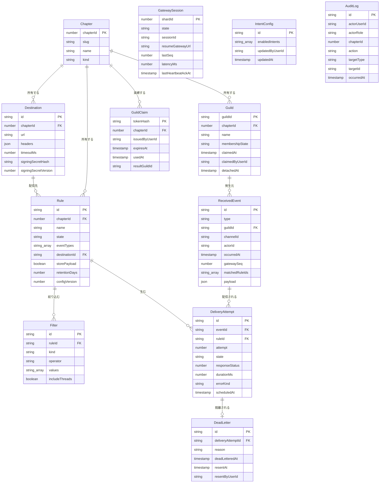

# 情報モデル

コンテキスト横断のエンティティ定義。

## SSoT の分担

| 区分 | 保持先 | 対象 |
|---|---|---|
| チャプターと所属 | **GDG Accounts** | INFO-001 の実体。本アプリは表示用キャッシュのみ持つ |
| 設定 | **Control Plane (D1)** | INFO-002 〜 INFO-006、INFO-011、INFO-012 |
| 実行時データのメタ | **Control Plane (D1)** | INFO-007 〜 INFO-009 の索引・集計対象の属性 |
| 実行時データの本文 | **Control Plane (R2)** | INFO-007 の `payload`、INFO-008 の `responseBody` |
| Gateway セッション状態 | **Data Plane (OCI のディスク)** | INFO-010。再起動をまたいで RESUME するため永続する。heartbeat で CP に複製される |

[ADR-001](../../../discord-relay/adr.md#adr-001-data-plane-を-gateway-転送専用に絞り配信を-control-plane-に寄せる)
により、配信は Control Plane が行う。したがって配信ログの SSoT も Control Plane にある。

**SCR-502（配信履歴）と SCR-503（DLQ 一覧）は「Data Plane が落ちている」という最も見たい障害のときに開かれる画面である。**
参照先を Data Plane に置くと、その瞬間に何も見えなくなる。これがメタを D1 に置く決定的な理由であり、
[ADR-006](../../../discord-relay/adr.md#adr-006-配信基盤に-cloudflare-queues-を採りメタデータは-d1本文は-r2-に置く)
で本文だけを R2 に分けたのは、一覧クエリを本文の重さに引きずらせないためである。

## ER 図

`GatewaySession` / `IntentConfig` / `AuditLog` は他エンティティと外部キーで結ばれない
独立レコードのため、リレーション線を持たない。

## 既存テーブルとの関係

`wiki.discord_guild_settings`（`guild_id` → `chapter_id`、`chapter_id` に UNIQUE）は
**共有しない**。目的が「リマインダー送信先チャンネル」であり、UNIQUE 制約により
1 チャプター 1 ギルドに固定されている。本アプリの INFO-002 は 1 チャプターに複数ギルドを許すため、
制約が両立しない。将来的に統合するなら `gdg-lib` への切り出しが前提になる。
