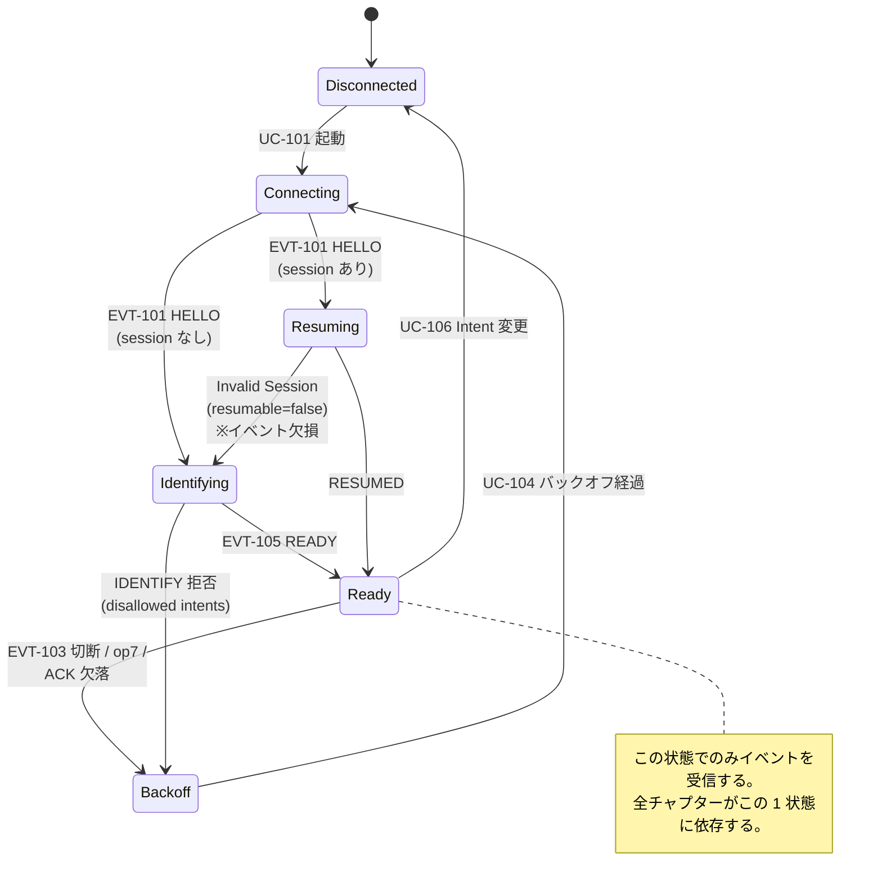
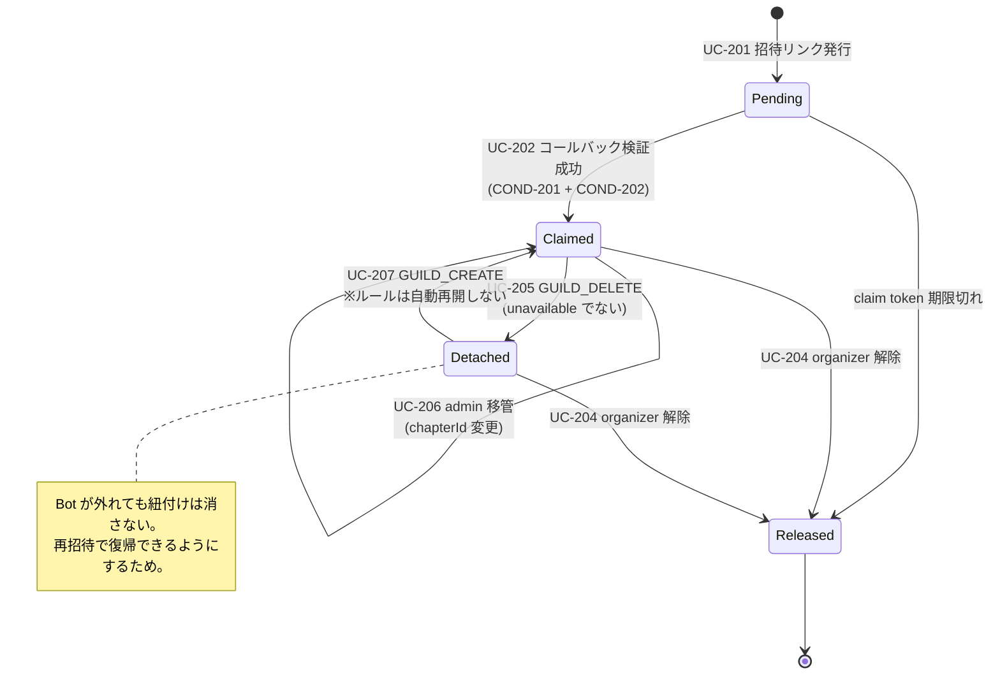
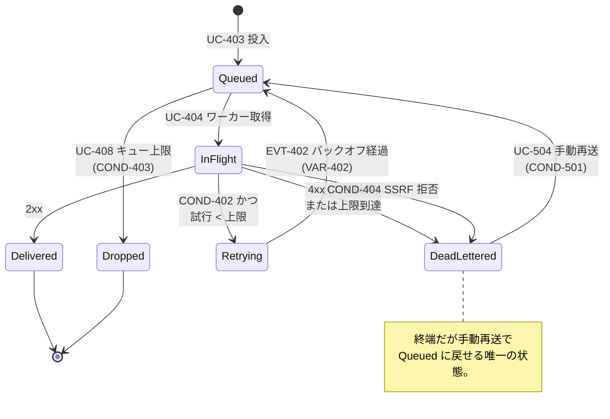
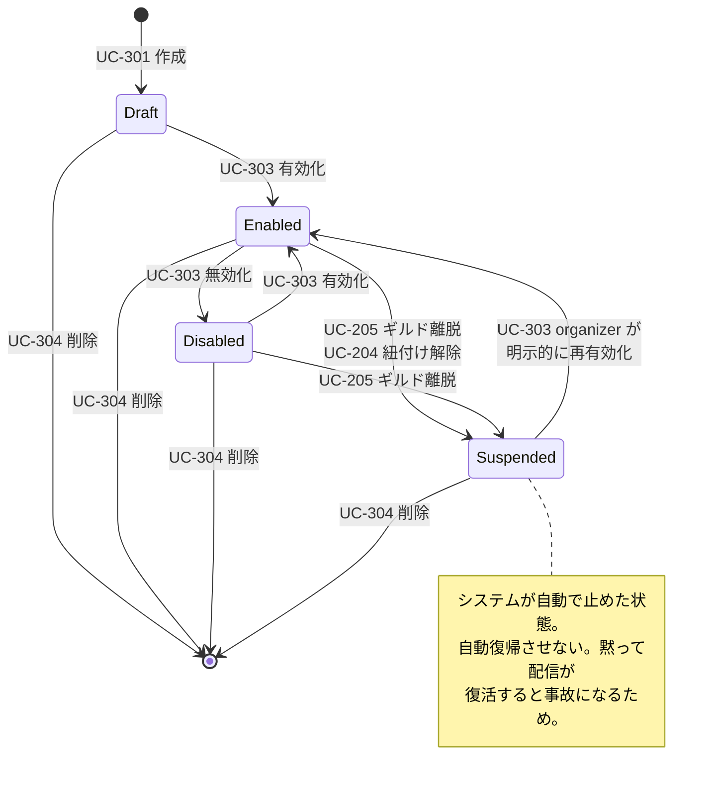
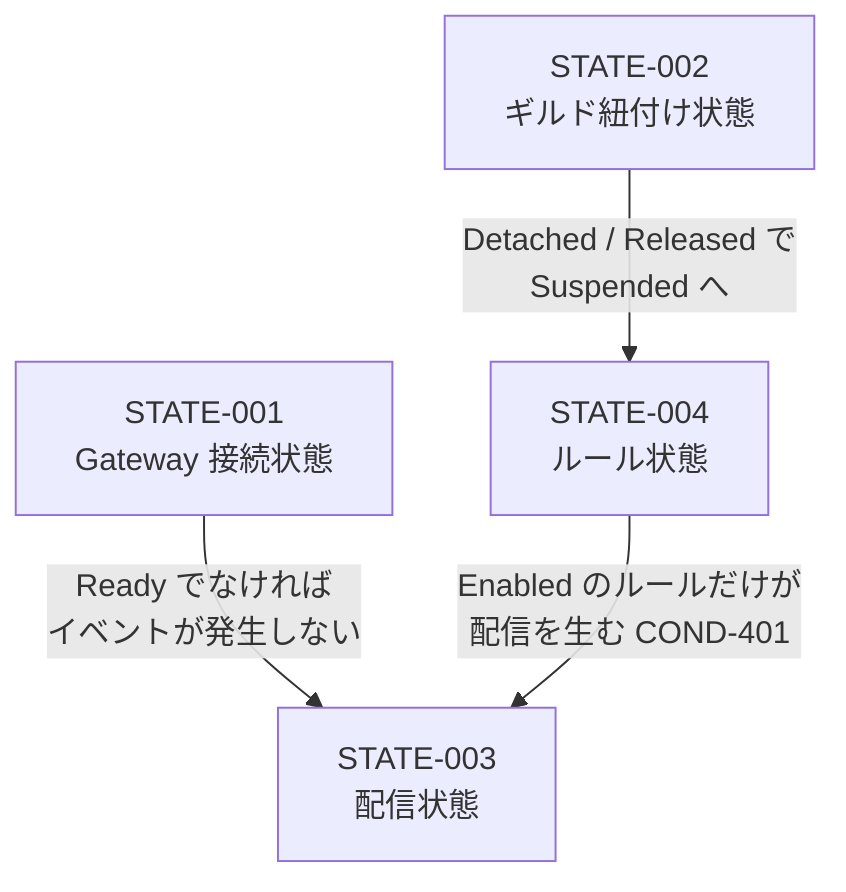

# 状態モデル

## STATE-001 Gateway 接続状態

## STATE-002 ギルド紐付け状態

## STATE-003 配信状態

## STATE-004 ルール状態

## 状態間の連動

3 つの状態モデルは独立ではなく、上流から下流へ連動する。

**「配信が来ない」の切り分けは、この連動を上から辿ることになる。**
BIZ-005 のライブイベントビューア（UC-501）は、この経路のどこで落ちたかを
画面上で示すことを目的としている。
